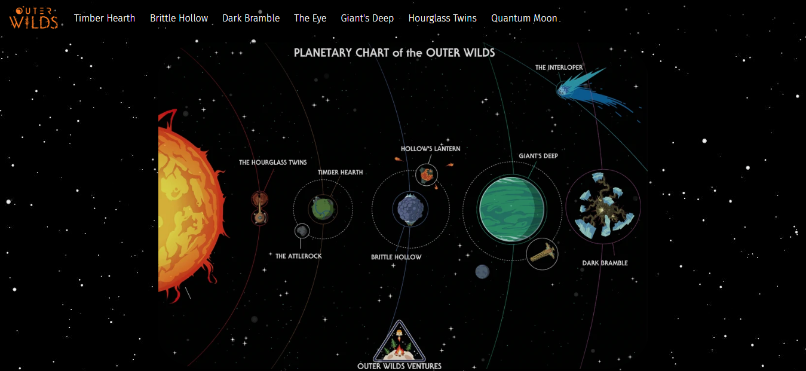

# Outer Wilds themed React Project 

A fan-made project that tries to simulate both ecosystem and information display of the game in a website style.

# Funcionalities and updates

You can navigate throught the pages and read information from the game's wiki.

Rotate animation and insert text box function will be coming soon.

# Scripts

In the project directory, you can run:

### `yarn start`

Runs the app in the development mode.\
Open [http://localhost:3000](http://localhost:3000) to view it in the browser.

The page will reload if you make edits.\
You will also see any lint errors in the console.

### `yarn test`

Launches the test runner in the interactive watch mode.\
See the section about [running tests](https://facebook.github.io/create-react-app/docs/running-tests) for more information.

### `yarn devbuild`

Builds the app for production to the `build` folder.\
it bundles the project with all the tools and local settings you need to work.

### `yarn build`

Builds the app for production to the `build` folder.\
It correctly bundles React in production mode and optimizes the build for the best performance.

The build is minified and the filenames include the hashes.\
Your app is ready to be deployed!

